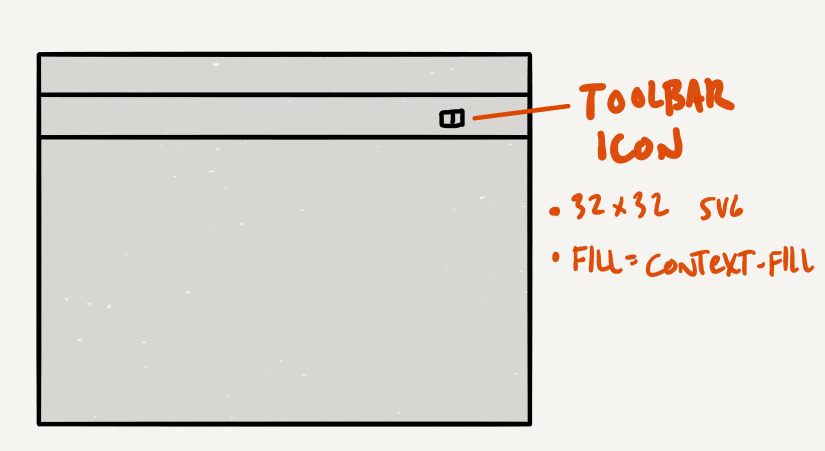
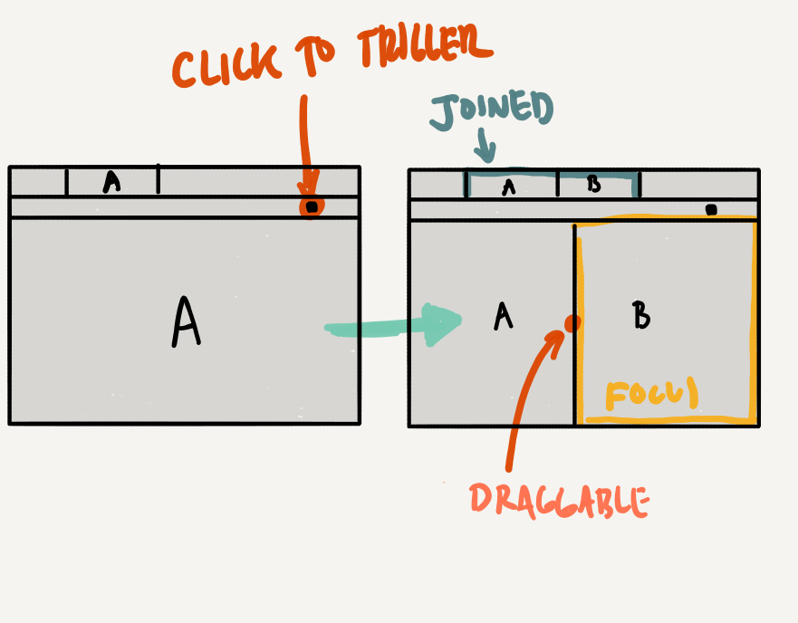
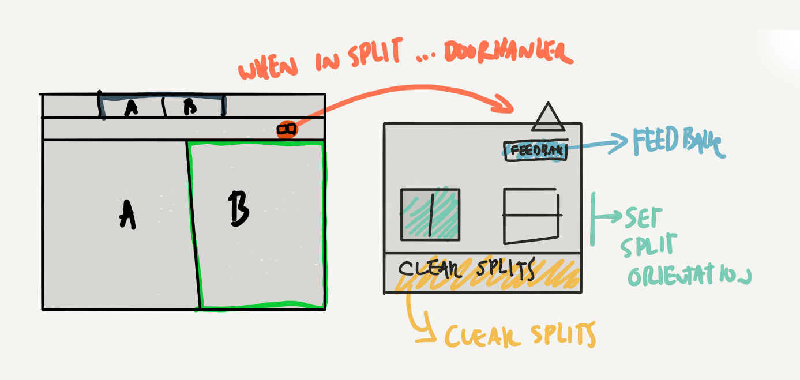
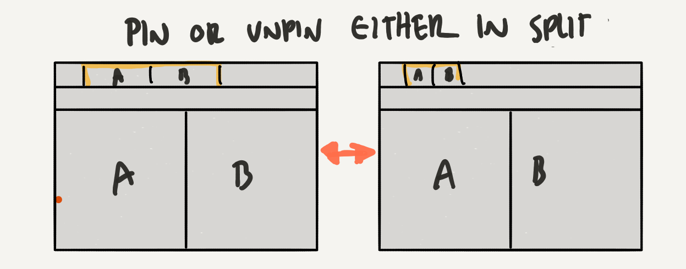
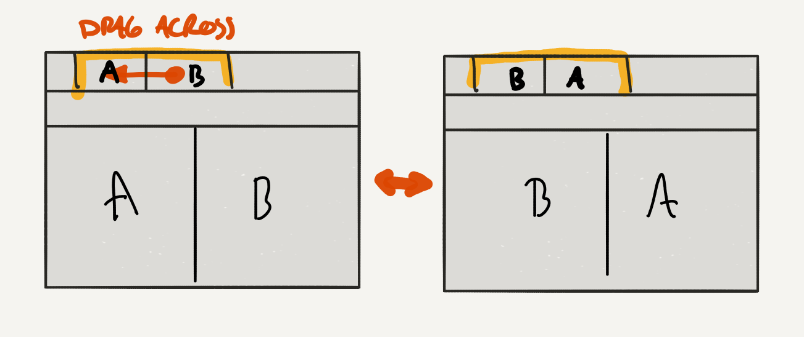
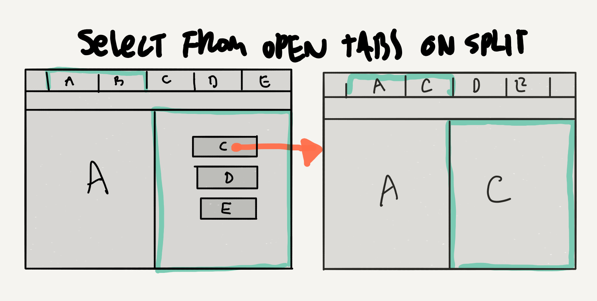
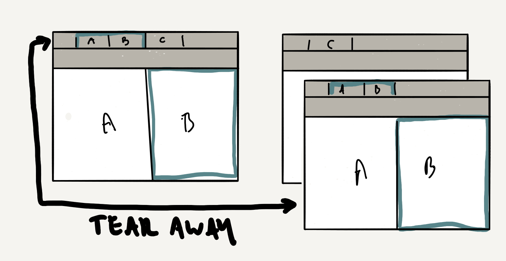
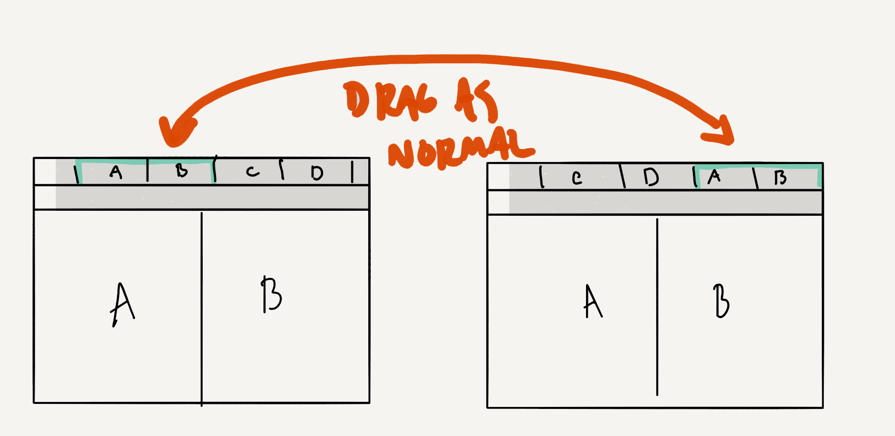

### In General
- [ ] It should generally match Photon styles.
- [ ] It should have a way for users to provide feedback without leaving the experiment.
- [ ] It should match final visual specs.

### Toolbar UI
- [ ] It should be accessible from the Firefox toolbar through a browserAction.
- [ ] It should have a toolbar icon that is not easily confused for the browser sidebar.
- [ ] It should have a toolbar icon that is a 32 x 32 SVG icon that accepts fill value of `context-fill`

### Basic Behaviors
- [ ] Clicking on the toolbar icon when in a non-split context should split pages vertically down the center.
- [ ] The already-open page should move to the left pane
- [ ] The newly open page should appear in the right pane
- [ ] The newly open page should receive focus.
- [ ] The focused tab is designated by a color outline.

- [ ] When in a split clicking the icon shows a doorhanger that should do the following:
1. Let the user give feedback
1. Let the user change the split orientation
1. Let the user clear all existing splits

- [ ] In a split clicking on a tab, content, or using standard tab switching hotkeys will switch the focused tab
- [ ] Closing one tab in a split will make the other tab revert to a normal non-split state

### Stretch features
- [ ] Pinning one tab in a split will pin both and maintain the split
- [ ] Unpinning one tab in a pinned split will unpin both and maintain the split

- [ ] In an AB split, dragging the B tab across the A tab will flip the tab layout so that the split is now BA.

- [ ] When a user first creates a split the splash page on tab B will list currently open tabs so that the user can select one to complete the split

- [ ] Pulling one of a pair of pinned tabs into a separate window will reproduce the split in the new window

- [ ] Split tabs can be dragged around like normal tabs an placed anywhere in the tab strip

### A11y
- [ ] All buttons and links should have visible focus states
- [ ] All buttons and links should be accessible via keyed entry (tab selection)
- [ ] All form elements should include appropriate label attributes
- [ ] All grouped buttons should be nested in a <fieldset> and described with a legend
- [ ] All UI should be verified to use A11y friendly contrast ratios
